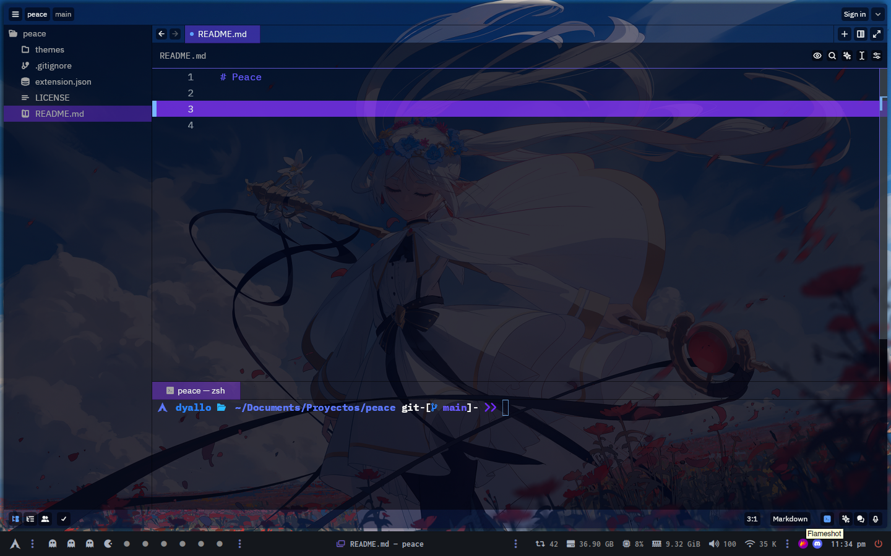

# Peace

## Installation

1. Clone the repository
2. CTRL + SHIFT + X, then `Install Dev Extension`
3. Select the folder of the repository
4. CTRL + SHIFT + P
5. Theme selector: toggle
6. Select `Peace`

## Development

1. Clone the repository
2. Move into the directory
3. Run `make` to generate a _dev file
4. Same as before CTRL + SHIFT + P
5. Select `Peace - DEV`

## Inspired by

[INDIGO](https://github.com/p3rception/Indigo-zed)
